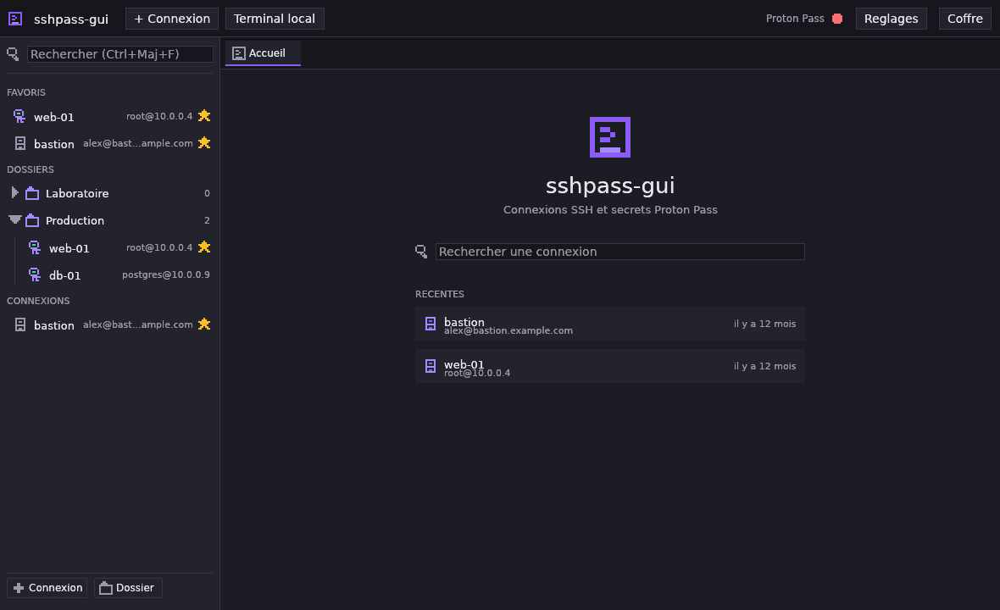
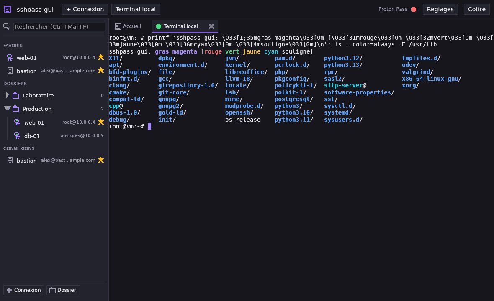

# sshpass-gui

Gestionnaire de connexions SSH avec terminal integre, **100 % Rust natif**,
adosse a **Proton Pass** pour les cles et les secrets.

Ni Electron, ni webview, ni GTK, ni Qt : une fenetre `winit`, un rendu OpenGL,
et une emulation de terminal en Rust pur.





Journal des versions : [CHANGELOG.md](CHANGELOG.md).

## Ce que ca fait

* **Barre laterale** : connexions, dossiers imbricables, favoris, recherche
  incrementale (`Ctrl+Maj+F`), actions rapides au survol.
* **Ecran d'accueil** : recherche et section « Recentes » (`nom` + `user@host`).
* **Terminal par onglet** : emulation xterm-256color, historique, selection
  souris (simple / mot / ligne), copier-coller, redimensionnement dynamique,
  couleurs 24 bits, gras et souligne.
* **Proton Pass dans l'interface** : parcourir les coffres et leurs items,
  associer un item a une connexion, voir et piloter l'etat des agents SSH.
* **Ecriture dans le coffre** : le mot de passe saisi dans la fiche part
  directement dans Proton Pass (titre, utilisateur et URL `ssh://` compris), et
  une cle SSH s'y importe ou s'y genere sans quitter l'application — voir
  [ADR 0007](docs/adr/0007-ecriture-dans-proton-pass.md).
* **Session surveillee** : une session Proton Pass ne survit pas a l'arret de
  la machine. sshpass-gui la verifie au demarrage, toutes les cinq minutes et
  a chaque appel qui echoue, puis relance `pass-cli login` et ouvre le lien
  d'authentification — voir [ADR 0008](docs/adr/0008-session-proton-pass.md).
* **CRUD des connexions** : creation, modification, suppression, deplacement
  entre dossiers, favoris et tags.
* **Autocompletion** sur l'hote, l'utilisateur, le coffre et l'item, alimentee
  par les connexions deja enregistrees et le coffre deja charge — navigation
  aux fleches, `Entree` ou `Tab` pour accepter, `Echap` pour fermer.
* **Interface animee** : survols en fondu, transitions de vue, fenetres et
  dossiers qui s'ouvrent et se referment, barre de chargement dans l'onglet
  pendant qu'une connexion SSH s'etablit, notifications qui entrent et sortent
  par le bord — le tout avec les animateurs natifs d'egui (aucune dependance
  ajoutee) — voir [ADR 0005](docs/adr/0005-animations-et-autocompletion.md).
* **Theme sombre violet/gris**, habillage pixel art dessine (icones, bordures,
  pastilles, curseur), texte en **police systeme**.

## Pile technique

| Role | Choix | Pourquoi |
| --- | --- | --- |
| Interface | [`egui`](https://github.com/emilk/egui) / `eframe` (backend `glow`) | mode immediat : acces direct au `Painter`, ideal pour la grille du terminal et le pixel art — voir [ADR 0001](docs/adr/0001-framework-gui.md) |
| Terminal | [`alacritty_terminal`](https://crates.io/crates/alacritty_terminal) | emulation VT100/xterm en Rust pur, sans `libvte` |
| Polices | [`fontdb`](https://crates.io/crates/fontdb) | lecture des polices systeme en Rust pur, sans `freetype` ni `font-kit` |
| Secrets | `pass-cli` en sous-processus | sortie `--output json` — voir [ADR 0002](docs/adr/0002-integration-pass-cli.md) |
| Config | TOML | lisible et editable a la main — voir [ADR 0004](docs/adr/0004-format-de-configuration.md) |
| Animations | `Context::animate_*` d'egui | interpolation par identifiant, rafraichissement demande automatiquement — voir [ADR 0005](docs/adr/0005-animations-et-autocompletion.md) |

Le pixel art se limite aux elements graphiques : **tout le texte** (libelles,
champs, terminal) utilise la police par defaut du systeme.

## Compilation

### Dependances systeme (Debian / Ubuntu)

```bash
sudo apt-get install -y \
  libxkbcommon-dev libxkbcommon-x11-dev libwayland-dev \
  libx11-dev libx11-xcb-dev libxcb-xkb-dev \
  libgl1-mesa-dev libfontconfig1-dev pkg-config
```

Sur une machine qui ne fait qu'**executer** le binaire, les paquets runtime
correspondants suffisent (`libxkbcommon-x11-0`, `libwayland-client0`, `libgl1`,
`libxcb-xkb1`).

### Construire et lancer

```bash
cargo build --release
./target/release/sshpass-gui
```

Rust 1.92 ou plus recent.

## Paquets

Chaque push produit les quatre formats en artefacts de la CI
(onglet **Actions** → dernier run → *Artifacts*) :

| Format | Fichier | Construit par |
| --- | --- | --- |
| Binaire Linux | `sshpass-gui-x86_64-linux` | `cargo build --release` |
| Debian / Ubuntu | `sshpass-gui_<version>-1_amd64.deb` | [`cargo-deb`](https://github.com/kornelski/cargo-deb) |
| Fedora / openSUSE | `sshpass-gui-<version>-1.x86_64.rpm` | [`cargo-generate-rpm`](https://github.com/cat-in-136/cargo-generate-rpm) |
| Portable | `sshpass-gui-<version>-x86_64.AppImage` | [`linuxdeploy`](https://github.com/linuxdeploy/linuxdeploy) |

Les reconstruire en local :

```bash
cargo install cargo-deb cargo-generate-rpm
cargo build --release
cargo deb --no-build       # -> target/debian/
cargo generate-rpm         # -> target/generate-rpm/
```

### Metadonnees des logitheques

`packaging/io.github.memton80.sshpass-gui.metainfo.xml` est le fichier
**AppStream** installe dans `/usr/share/metainfo/` par le `.deb`, le `.rpm` et
l'AppImage. C'est lui, et lui seul, que lisent KDE Discover, GNOME Logiciels et
les autres logitheques pour afficher le nom, l'**auteur**, le resume, les
captures et l'historique des versions. Sans lui, une logitheque ne dispose que
du nom du paquet et affiche « Auteur inconnu ».

Le resume court est repris a l'identique sur cinq surfaces — `description` de
`Cargo.toml`, `summary` du RPM, `Comment` du `.desktop`, `<summary>` AppStream
et la description du `.deb` — pour que l'application ne se decrive pas de deux
facons selon l'outil qui l'affiche.

Apres toute modification :

```bash
desktop-file-validate packaging/sshpass-gui.desktop
appstreamcli validate --no-net --pedantic \
  packaging/io.github.memton80.sshpass-gui.metainfo.xml
```

La CI rejoue ces deux validations, verifie que le metainfo contient bien une
entree `<release>` pour la version de la caisse, et que le fichier est present
dans le `.deb` et le `.rpm` livres. **Toute montee de version doit donc ajouter
son `<release>`** dans le metainfo, sinon la CI echoue.

Pour verifier ce qu'une logitheque affichera reellement :

```bash
sudo install -Dm644 packaging/io.github.memton80.sshpass-gui.metainfo.xml \
  /usr/share/metainfo/io.github.memton80.sshpass-gui.metainfo.xml
sudo appstreamcli refresh-cache --force
appstreamcli dump io.github.memton80.sshpass-gui
```

#### Les permissions affichees

Discover indique « Acces total — peut acceder a la totalite du systeme ». Ce
n'est pas un oubli de metadonnee : c'est ce qu'affichent **tous** les paquets
natifs (`.deb`, `.rpm`), qui ne sont pas places dans un bac a sable. Seuls
Flatpak et Snap declarent des permissions fines, et un Flatpak n'aiderait pas
ici : l'application lance `ssh` et `pass-cli` **de l'hote** et ouvre des
sockets d'agent, ce qui exigerait `--talk-name=org.freedesktop.Flatpak`,
c'est-a-dire une sortie de bac a sable — donc le meme « acces total », au prix
d'un paquet plus fragile.

Ce que l'application touche reellement est court : `~/.config/sshpass-gui/`
pour sa configuration (jamais de secret), `$XDG_RUNTIME_DIR/sshpass-gui/` pour
les sockets d'agent et les scripts askpass, et les processus `ssh` et
`pass-cli`.

### Dependances declarees

`winit`, `glutin` et `xkbcommon-dl` ouvrent leurs bibliotheques par `dlopen`,
pas par edition de liens : le binaire ne declare que `libc`, `libm` et
`libgcc`. Ni `dpkg-shlibdeps` ni l'analyse ELF du RPM ne voient donc les
bibliotheques graphiques, et un paquet reduit a ses dependances automatiques
paniquerait au premier lancement sur une machine sans `libxkbcommon-x11`.

Elles sont donc declarees a la main dans `Cargo.toml` — par nom de paquet pour
le `.deb`, par soname pour le `.rpm` (les noms de paquets different entre
Fedora et openSUSE). Pour verifier la liste apres une montee de version d'egui
ou de winit :

```bash
strings -a target/release/sshpass-gui | grep -oE 'lib[A-Za-z0-9_-]+\.so(\.[0-9]+)+' | sort -u
```

L'AppImage n'embarque aucune de ces bibliotheques : elles figurent toutes sur
la liste d'exclusion AppImage (pilotes graphiques et bibliotheques systeme, qui
doivent venir de l'hote).

### Pourquoi `sshpass-gui` et non `sshpass`

Debian et Ubuntu distribuent deja un paquet **`sshpass`** : l'outil en ligne
de commande qui fournit un mot de passe a `ssh` de maniere non interactive
(version 1.09 dans `noble/universe`). Il n'a aucun rapport avec ce projet,
mais il porterait le meme nom **et** installerait le meme
`/usr/bin/sshpass` : les deux paquets ne pourraient pas coexister, et un
`apt upgrade` remplacerait l'un par l'autre selon lequel porte le plus grand
numero de version.

D'ou le nom `sshpass-gui` pour la caisse, le binaire, les paquets et le
fichier `.desktop` — voir [ADR 0006](docs/adr/0006-renommage-sshpass-gui.md).
Le depot, lui, garde son nom.

Une configuration ecrite avant ce renommage, dans `~/.config/sshpass/`, est
**reprise automatiquement** au premier demarrage : elle est copiee vers
`~/.config/sshpass-gui/`, l'original restant en place.

### Icone et fichier `.desktop`

L'icone n'est pas dessinee a la main : elle est rasterisee depuis la meme
grille 8x8 que `pixel::TERMINAL`, avec la palette de `theme.rs`. Apres toute
modification du sprite :

```bash
python3 packaging/generate-icon.py
```

## Utilisation

### Premier lancement

Sans configuration, l'accueil propose de creer une connexion. Le fichier est
ecrit dans `~/.config/sshpass-gui/config.toml` a la premiere sauvegarde.

Pour travailler sur une configuration de test :

```bash
SSHPASS_GUI_CONFIG=/tmp/essai.toml ./target/release/sshpass-gui
```

### Proton Pass

sshpass-gui appelle le binaire `pass-cli` (configurable dans les reglages). La
pastille de la barre d'outils indique s'il est detecte ; un clic relance la
detection.

Trois modes d'agent, au choix dans les reglages :

* **Agent dedie** *(defaut)* — sshpass-gui demarre un `pass-cli ssh-agent start` par
  coffre et injecte le `SSH_AUTH_SOCK` correspondant dans chaque onglet.
* **Agent existant** — `pass-cli ssh-agent load` pousse les cles dans l'agent
  deja en place ; sshpass-gui ne surcharge rien.
* **Desactive** — les onglets heritent de l'environnement.

Detail de la strategie : [ADR 0003](docs/adr/0003-ssh-auth-sock.md).

### Session et reconnexion

Toutes les commandes `pass-cli` supposent une session ouverte, et cette session
**ne survit pas a l'arret de la machine**. sshpass-gui la verifie avec
`pass-cli info` :

* au demarrage ;
* toutes les cinq minutes, meme fenetre inactive ;
* des qu'un appel echoue en signalant un probleme d'autorisation ;
* avant d'ouvrir une connexion adossee au coffre — inutile d'ouvrir un onglet
  qui echouera.

Quand la session est fermee, `pass-cli login` est relance et **le lien
d'authentification s'ouvre dans le navigateur**. Une fois le flux termine, la
session est resondee et l'application repart. Aucun identifiant ne passe par
sshpass-gui : tout se joue entre le navigateur et Proton.

La pastille de la barre d'outils distingue les quatre etats :

| Pastille | Etat | Quoi faire |
| --- | --- | --- |
| Verte | session ouverte | rien |
| Orange « Session fermee » | expiree ou machine redemarree | rien, la reconnexion part seule |
| Orange « Reconnexion... » | flux en cours | terminer dans le navigateur |
| Rouge « Session verrouillee » | verrouillee par un code | `pass-cli session unlock` |

Une tentative qui echoue **n'est jamais reessayee toute seule** : le panneau
lateral affiche alors un bouton « Se reconnecter ». L'ouverture automatique du
navigateur se desactive dans les reglages (`auto_login`) ; la detection, elle,
continue. Si aucun ouvreur de liens n'est installe (`xdg-open`, `open`), le
panneau affiche l'URL avec un bouton « Copier le lien ».

Le verrouillage de session (`pass-cli session create-lock`) n'est pas
automatisable : le code n'est connu que de l'utilisateur, et `session unlock`
le demande sur un terminal.

### Mots de passe

Pour une connexion en `auth = "password"`, sshpass-gui **ne lit jamais le secret**.
Il ecrit un script `SSH_ASKPASS` (mode 0700) qui ne contient que l'URI
`pass://coffre/item/champ`, et laisse `ssh` l'executer lui-meme. Le mot de passe
ne passe donc ni par la memoire de sshpass-gui, ni par le PTY, ni par les journaux.

Necessite OpenSSH 8.4 ou plus recent (pour `SSH_ASKPASS_REQUIRE=force`).

### Enregistrer un secret dans le coffre

La fiche de connexion ecrit aussi **vers** Proton Pass : plus besoin de creer
l'item a la main avant de pouvoir s'en servir.

**Mot de passe.** Choisissez « Mot de passe (Proton Pass) », un coffre, puis
saisissez le mot de passe du serveur et cliquez sur **Enregistrer dans Proton
Pass**. L'item est cree avec le titre de la connexion, l'utilisateur SSH et
l'URL `ssh://user@hote:port`, et la fiche s'y rattache toute seule. Si un item
du meme titre existe deja, le bouton devient **Mettre a jour** et remplace le
mot de passe au lieu d'en creer un second.

**Cle SSH.** Avec « Agent SSH » ou « Fichier de cle », le meme bloc propose de
**generer** une paire (Ed25519, RSA 2048 ou RSA 4096) directement dans le
coffre, ou d'**importer** le fichier de cle indique. La connexion bascule alors
en `auth = "agent"` : la cle est servie par l'agent du coffre, plus par un
fichier local. Reste a deposer la cle publique sur le serveur — elle se lit
depuis l'application Proton Pass, ou avec `ssh-add -L` sur la socket de l'agent
que le panneau lateral affiche.

Ou passe le secret, exactement :

| Operation | Commande `pass-cli` | Transmission |
| --- | --- | --- |
| Creation d'un identifiant | `item create login --from-template -` | entree standard |
| Mise a jour d'un mot de passe | `item update --field password=…` | ligne de commande |
| Import d'une cle | `item create ssh-key import --from-private-key` | un chemin |
| Generation d'une cle | `item create ssh-key generate` | rien ne sort du coffre |

La creation passe par l'entree standard, donc le mot de passe n'apparait pas
dans `/proc/<pid>/cmdline`. La **mise a jour** est la seule exception :
`pass-cli item update` n'accepte les valeurs que sur sa ligne de commande.
L'interface l'indique sous le bouton. Rien n'est jamais ecrit sur le disque, et
le champ de saisie est efface des le clic — voir
[ADR 0007](docs/adr/0007-ecriture-dans-proton-pass.md).

### Raccourcis

| Raccourci | Effet |
| --- | --- |
| `Ctrl+Maj+F` | Recherche dans la barre laterale |
| `Ctrl+Maj+T` | Terminal local |
| `Ctrl+Maj+P` | Panneau Proton Pass |
| `Ctrl+Maj+Tab` | Onglet suivant |
| `Ctrl+Maj+C` / `Ctrl+Maj+V` | Copier / coller dans le terminal |
| `Ctrl+Maj+A` | Tout selectionner dans le terminal |
| `Ctrl+Maj+W` | Fermer l'onglet |
| `Maj+PagePrec` / `Maj+PageSuiv` | Defiler l'historique |
| `Haut` / `Bas`, `Entree`, `Echap` | Naviguer, accepter, fermer une liste de suggestions |

Les combinaisons `Ctrl+Maj+…` sont reservees a l'interface : tout le reste
descend dans le terminal, y compris `Ctrl+C`, `Ctrl+D` et `Ctrl+F`.

## Configuration

Le format complet est decrit dans
[ADR 0004](docs/adr/0004-format-de-configuration.md). L'essentiel :

```toml
version = 1

[proton_pass]
binary = "pass-cli"
agent_mode = "own-agent"
auto_login = true

[[connections]]
id = "8a12…"
name = "web-01"
host = "10.0.0.4"
user = "root"
port = 22
favorite = true
auth = "agent"
tags = ["prod"]

[connections.proton]
vault = "SSH Keys"
item = "web-01"
```

**Aucun secret n'est ecrit dans ce fichier** — uniquement des references vers
les items du coffre. Un test unitaire le verifie.

## Developpement

```bash
cargo test                          # tests unitaires (sans pass-cli ni serveur X)
cargo clippy --all-targets -- -D warnings
cargo fmt --all -- --check
```

Essayer l'interface sans serveur d'affichage :

```bash
xvfb-run -a --server-args="-screen 0 1280x800x24" ./target/debug/sshpass-gui
```

### Organisation

```
packaging/         .desktop, icone, metadonnees AppStream des logitheques
src/
├── main.rs        point d'entree, chargement de la configuration
├── app.rs         etat global, boucle eframe, file d'actions
├── theme.rs       palette sombre et polices systeme
├── config/        modele de donnees et persistance TOML
├── pass/          pass-cli (cli.rs), agents SSH (agent.rs), secrets (secret.rs),
│                  reconnexion (login.rs), pont askpass
├── term/          session PTY, encodage clavier, couleurs, rendu egui
└── ui/            panneaux, fenetres, animations, autocompletion, pixel art
```

## Integration continue

`.github/workflows/build.yml`, trois jobs :

* **checks** — `cargo fmt --check`, `clippy -D warnings`, `cargo test`, plus la
  validation des metadonnees de logitheque (`desktop-file-validate`,
  `appstreamcli validate --pedantic`, et la coherence de version).
* **linux** — build release, puis `.deb`, `.rpm` et AppImage.

Les binaires ne sont pas seulement compiles : `.github/scripts/smoke-test.sh`
les **lance vraiment** sur un serveur X virtuel et echoue s'ils s'arretent
dans les quinze secondes. Un binaire qui compile mais panique au demarrage —
bibliotheque absente, police introuvable, contexte OpenGL refuse — est ainsi
detecte. Le binaire nu et l'AppImage passent chacun ce test.

## Limites connues

* Le rapport de souris (`MOUSE_REPORT_CLICK`) n'est pas transmis aux
  applications distantes : la souris pilote la selection locale. La molette est
  bien traduite en fleches sur l'ecran alternatif (`less`, `vim`).
* L'italique du terminal est rendu avec la fonte normale (le gras a bien sa
  propre famille).
* Le schema JSON exact de `pass-cli` n'etant pas publie, les analyseurs sont
  tolerants et testes sur plusieurs conventions de nommage
  ([ADR 0002](docs/adr/0002-integration-pass-cli.md)) ; a confronter a une
  sortie reelle. Les commandes d'ecriture, elles, sont documentees et leurs
  arguments verifies par des tests qui pilotent un faux `pass-cli`.
* Mettre a jour un mot de passe expose brievement sa valeur dans
  `/proc/<pid>/cmdline` : `pass-cli item update` n'offre aucune alternative a
  `--field`. La creation, elle, passe par l'entree standard
  ([ADR 0007](docs/adr/0007-ecriture-dans-proton-pass.md)).
* La cle publique d'une cle generee n'est pas affichee dans l'application : la
  lire supposerait de recuperer aussi la partie privee. Elle se recupere depuis
  Proton Pass ou via `ssh-add -L`.
* La detection d'une session fermee repose sur les tournures anglaises de
  `pass-cli`, faute de code de sortie dedie. Un `info` en echec est de toute
  facon traite comme une session fermee, ce qui garde le comportement correct
  ([ADR 0008](docs/adr/0008-session-proton-pass.md)).
* **Systemes Unix uniquement.** Le PTY, les sockets d'agent et le pont
  `SSH_ASKPASS` reposent sur des mecanismes POSIX; compiler pour Windows
  s'arrete sur un `compile_error!` explicite. Cible eprouvee : Linux
  (KDE/Wayland et X11).
* Pas de paquet macOS ni de `.dmg` pour l'instant, et pas de build ARM64.

## Licence

GPL-3.0-or-later — voir [LICENSE](LICENSE).
